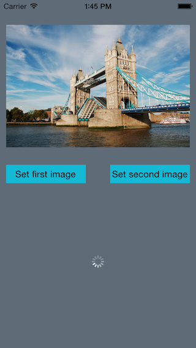

# MHAlbumView

## Usage

A UIImageView subclass, which shows a spinning UIActivityIndicator as long as it's image property is nil. Additionally you can attach a action-block which gets fired when the image is tapped.

## Author

Martin Hartl, martin@mhaddl.me

## License

MHSegmentedView is available under the MIT license. See the LICENSE file for more info.

